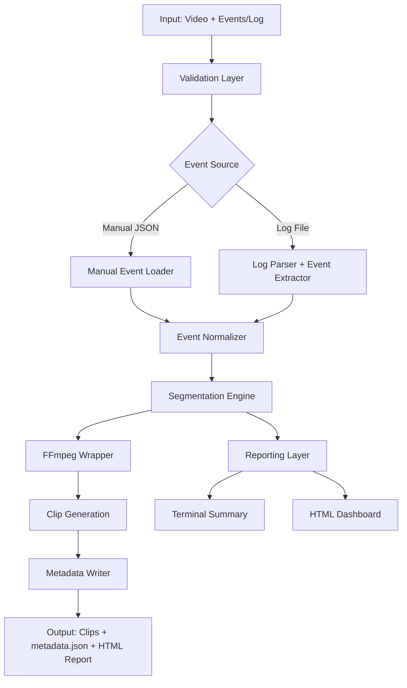

# QA Event Artifact Generator

A Python CLI tool that converts long test recordings into event-based video clips with structured metadata for faster debugging and QA workflows.

## Project Status
All phases completed (0-5). This repository demonstrates a full QA tooling pipeline from manual event segmentation to log-driven automation, with comprehensive testing and deterministic fixture generation.

## Why This Matters for QA
This tool transforms lengthy test recordings into focused, event-level artifacts that accelerate:
- **Bug reproduction**: Quickly isolate and share specific failure moments
- **Defect reporting**: Attach precise video evidence with timestamps and context
- **Test analysis**: Review only relevant segments instead of entire recordings
- **Team collaboration**: Share structured artifacts instead of raw video files

## Architecture Overview



## Requirements
- Python 3.10+
- `ffmpeg` installed and available on `PATH`

## Install
```bash
python -m pip install -e .
```

## Requirements
- Python 3.10+
- `ffmpeg` installed and available on `PATH`

## Install
```bash
python -m pip install -e .
```

## Workflow: Before vs After

### Before: Manual Video Review
1. QA finds a bug in a 30-minute test recording
2. Shares entire video file (large, hard to navigate)
3. Developer watches full video to find the issue
4. Time-consuming, error-prone, poor collaboration

### After: Event-Based Artifacts
1. QA defines events in JSON or extracts from logs
2. Tool generates focused 5-10 second clips per event
3. Developer reviews only relevant segments with timestamps
4. Fast, precise, shareable artifacts with metadata

## Event JSON Schema
The manual event file supports duration and point-in-time events.

Duration event example:
```json
{
  "label": "LOGIN_SCREEN",
  "start": "00:05",
  "end": "00:10",
  "notes": "User logged in",
  "tags": ["login", "ui"]
}
```

Point event example:
```json
{
  "label": "ERROR_POPUP",
  "timestamp": "00:20",
  "pre_buffer": "00:02",
  "post_buffer": "00:03",
  "notes": "Capture error dialog"
}
```

Top-level defaults can be provided using an object with `events`, `default_pre_buffer`, and `default_post_buffer`.

## Usage Examples

### Manual Event Segmentation
```bash
# Validate events without generating clips
qa-event-artifact-generator --video input/sample_video.mp4 --events input/events.manual.json --output output/ --dry-run

# Generate clips and metadata
qa-event-artifact-generator --video input/sample_video.mp4 --events input/events.manual.json --output output/

# Generate clips with HTML report
qa-event-artifact-generator --video input/sample_video.mp4 --events input/events.manual.json --output output/ --html-report output/report.html
```

### Log-Driven Event Generation
```bash
# Extract events from logs and generate clips
qa-event-artifact-generator \
  --video input/sample_video.mp4 \
  --log input/sample_log.txt \
  --recording-start 2026-04-04T12:00:00 \
  --event-rules config/event_rules.json \
  --generate-events output/generated_events.json \
  --output output/ \
  --html-report output/report.html

# Suggest events from log without processing
qa-event-artifact-generator \
  --log input/sample_log.txt \
  --event-rules config/event_rules.json \
  --suggest-events
```

## Sample Output

After a successful run, the output directory contains generated clip files, `metadata.json`, and optional HTML report.

### Terminal Summary
```
QA Event Artifact Generator
  video: input/sample_video.mp4
  events: input/events.manual.json
  output: output/
  event count: 3
  video duration: 35.00s
Generated 3 clip(s) and metadata to output/

Processing Summary:
  Total events: 3
  Duration events: 2
  Point events: 1
  Successful clips: 3
  Failed/skipped clips: 0
  Total warnings: 1
  Output directory: output/
  Validation warnings: 1
```

### Metadata Structure
```json
{
  "source_video": "input/sample_video.mp4",
  "generated_at": "2026-04-04T12:34:56Z",
  "clips": [
    {
      "label": "LOGIN_SCREEN",
      "clip_path": "output/01-LOGIN_SCREEN.mp4",
      "start": 5.0,
      "end": 10.0,
      "duration": 5.0,
      "notes": "User logged in",
      "tags": ["login", "ui"]
    }
  ]
}
```

## Sample Generation
Generate sample logs and event JSON fixtures:

This project includes deterministic fixture generation scripts so sample data can be recreated reliably across environments. The generated fixtures are intended for local testing and demonstration without relying on sensitive or proprietary footage.

```bash
python scripts/generate_sample_log.py --output-dir input/fixtures
```

Generate a sample video with ffmpeg:
```bash
python scripts/generate_sample_video.py --output input/fixtures/short_session_video.mp4
```

Convert CSV to events JSON:
```bash
python scripts/csv_to_json.py --csv events.csv --output events.manual.json --label-column label --start-column start --end-column end
```

## Development
Run tests with:
```bash
pytest
```

## Future Roadmap
- CSV-to-JSON event import helpers ✓
- Configurable clipping profiles by event type ✓
- (Deferred) Enhanced HTML dashboard with video previews
- (Deferred) Traceability links for test case/bug report integration
- Advanced log correlation with multiple time sources ✓
- Semi-automated event capture workflows ✓
- PyPI packaging and distribution ✓
- GitHub Actions CI/CD pipeline ✓

## Resume Summary
**QA Event Artifact Generator** - Python CLI tool for automated video segmentation and metadata generation. Built end-to-end QA workflow tooling with FFmpeg integration, log parsing, and comprehensive testing. Demonstrates engineering discipline through deterministic fixture generation and clean architecture.
